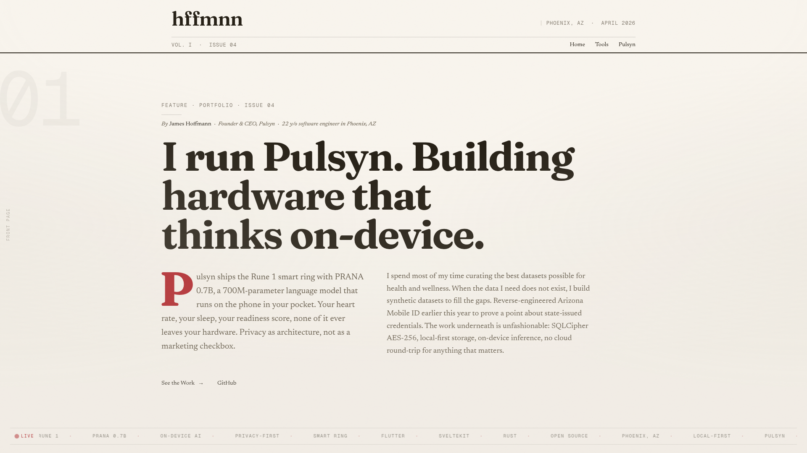
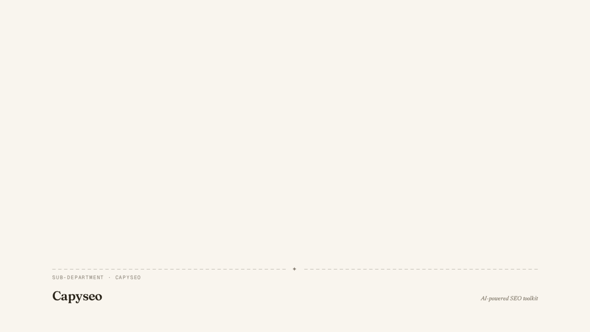
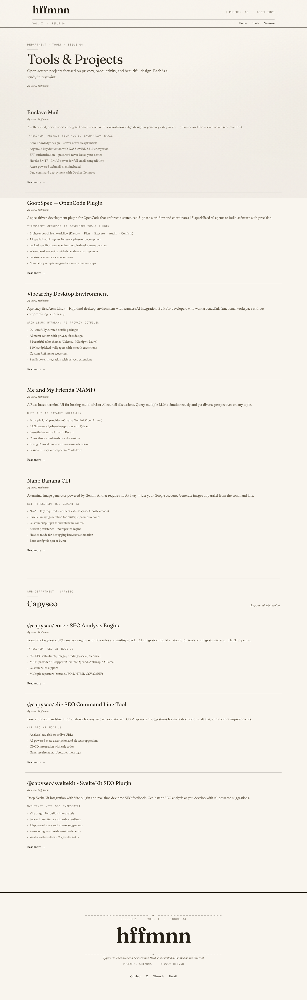
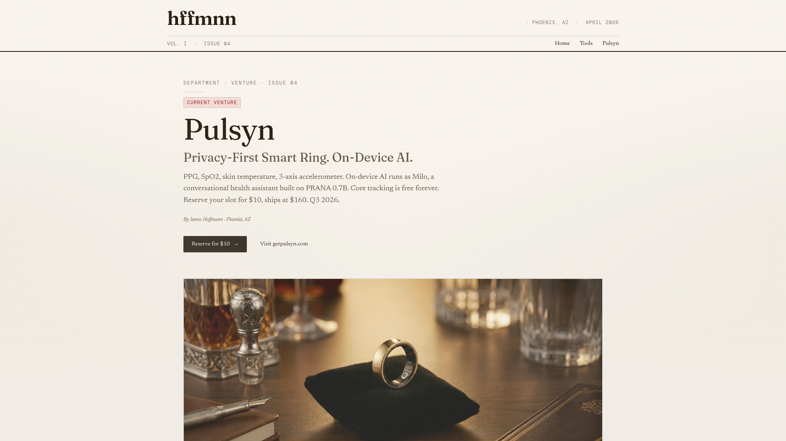
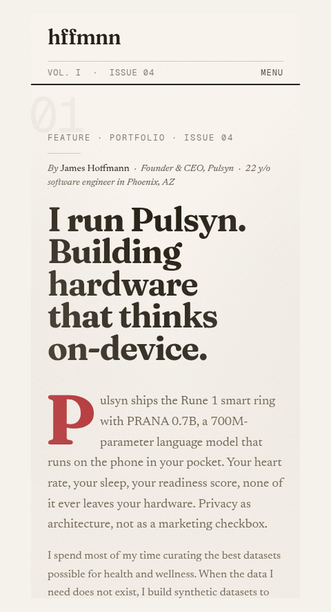

# hffmnn.com



[](LICENSE)
[](https://svelte.dev)
[](https://svelte.dev)
[](https://tailwindcss.com)
[](https://bun.sh)
[](https://kit.svelte.dev/docs/adapter-static)

Personal portfolio and project showcase. Eight open source tools across privacy infrastructure, on-device AI, and developer tooling. Built with SvelteKit 2, Svelte 5, and Tailwind CSS v4. The design follows an editorial newspaper aesthetic: warm paper substrate, Fraunces serif, hairline rules, drop caps, and a sticky masthead.

## Screenshots

### Homepage



### Tools



### Project Detail


### Venture (Pulsyn)



### Mobile



## Features

- **Editorial newspaper design** — Warm paper substrate with Fraunces + Newsreader + Geist Mono typography, hairline rules, drop caps, and ornamental section breaks
- **Auto-fetched GitHub READMEs** — Project detail pages pull live README content from GitHub at build time and render it with editorial styling
- **Variable font motion** — Fraunces optical-size, SOFT, and weight axes animate on hover via typed `@property` custom properties, with per-word staggering on headings
- **Scroll-driven reveals** — IntersectionObserver-powered entry animations on ledger rows, section cards, and skill rows
- **CSS paper grain** — Fixed SVG turbulence overlay with a warm vignette gives pages a tactile print feel
- **Self-hosted fonts** — All typefaces served from the bundle; zero external font requests
- **Static generation** — Pre-rendered HTML via `adapter-static`; no server required at runtime
- **Zero analytics** — No tracking, no cookies, no third-party scripts

## Tech Stack

| Category | Technology |
|----------|------------|
| Framework | [SvelteKit 2](https://svelte.dev) with [Svelte 5](https://svelte.dev/docs/svelte/overview) (runes syntax) |
| Styling | [Tailwind CSS v4](https://tailwindcss.com) (Vite plugin, `@theme inline`) |
| Runtime | [Bun](https://bun.sh) |
| Fonts | [Fraunces](https://fonts.google.com/specimen/Fraunces) + [Newsreader](https://fonts.google.com/specimen/Newsreader) + [Geist Mono](https://vercel.com/font) via `@fontsource` |
| Markdown | [Marked](https://marked.js.org) |
| SEO | [Capyseo](https://github.com/Capyseo) (build-time and dev-time analysis) |
| Deployment | Static adapter (any static host) |

## GitHub README Auto-Fetch

Project detail pages fetch and render each project's `README.md` directly from GitHub at build time. Relative image paths are rewritten to absolute GitHub raw URLs, relative links are resolved to GitHub blob URLs, and the rendered output is styled to match the editorial design system.

### How It Works

1. **Project data** (`src/lib/data/projects.ts`) declares the GitHub owner and repo:
   ```ts
   {
     slug: 'vibearchy',
     githubOwner: 'hffmnnj',
     githubRepo: 'Vibearchy',
   }
   ```

2. **Fetch at build** (`src/routes/tools/[slug]/+page.ts`) pulls the raw file:
   ```ts
   const url = `https://raw.githubusercontent.com/${project.githubOwner}/${project.githubRepo}/main/README.md`;
   const response = await fetch(url);
   const markdown = await response.text();
   ```

3. **Transform and render** (`src/lib/utils/markdown.ts`) rewrites paths and applies editorial styles to all markdown elements.

### Adding a Project

1. Add an entry to the appropriate array in `src/lib/data/projects.ts`:
   ```ts
   {
     slug: 'my-project',
     title: 'My Project',
     description: 'Full description shown on the detail page.',
     shortDescription: 'Brief description shown on cards.',
     tags: ['Rust', 'CLI'],
     githubUrl: 'https://github.com/user/my-project',
     githubOwner: 'user',
     githubRepo: 'my-project',
     features: ['Feature one', 'Feature two']
   }
   ```

2. Spread the array in the `entries` generator in `src/routes/tools/[slug]/+page.ts`. This is required for `adapter-static` to prerender the slug. Skipping this step silently omits the page from the build.

3. Run `bun run build`. The new page is generated at `/tools/my-project`.

## Design System

### Colors

All colors use `oklch` for perceptual uniformity. The accent is a classic ink red; brand colors are registered in `:root` and mapped in `@theme inline` for Tailwind utility generation.

```css
--paper:          oklch(97% 0.01 80);    /* Warm off-white substrate */
--ink:            oklch(25% 0.02 80);    /* Charcoal foreground */
--ink-soft:       oklch(45% 0.03 80);    /* Secondary text */
--ink-faint:      oklch(60% 0.02 80);    /* Tertiary / kicker labels */
--accent:         oklch(50% 0.18 25);    /* Ink red */
--paper-elevated: oklch(95% 0.01 80);    /* Card surfaces */
--pulsyn:         oklch(75% 0.18 160);   /* Pulsyn brand green */
--capybara:       oklch(55% 0.11 42);    /* Capyseo brand brown */
```

### Typography

- **Display** — Fraunces Variable. Optical size, SOFT, and weight axes animate smoothly on hover via `@property` typed custom properties.
- **Body** — Newsreader Variable. Screen-optimized optical sizes with oldstyle numerals.
- **Mono** — Geist Mono Variable. Used for kicker labels, datelines, and section metadata.

### Editorial Components

```
src/lib/components/editorial/
├── Masthead.svelte      — Nameplate, dateline, vol/issue, nav slot
├── Kicker.svelte        — Uppercase tracked mono eyebrow label
├── Rule.svelte          — Hairline / heavy / dotted / spacer variants
├── DropCap.svelte       — Accent-colored first-letter with optical baseline
├── Byline.svelte        — Italic "By James Hoffmann · Phoenix, AZ"
├── IssueTag.svelte      — ISSUE / VOL. / CURRENT mono pill
├── Marginalia.svelte    — XL-only sidebar aside
├── RunningHeader.svelte — XL-only vertical section breadcrumb
└── index.ts             — Barrel export
```

### CSS Utilities

```css
.paper-texture    /* Fixed SVG grain overlay + ambient vignette */
.fraunces-hover   /* Variable font axis animation via @property */
.editorial-link   /* Accent underline draw-in on hover */
.has-drop-cap     /* First-letter drop cap (accent color) */
.editorial-mono   /* Uppercase tracked Geist Mono */
.editorial-byline /* Italic Newsreader */
.ornament-break   /* Dotted rails + centered glyph section divider */
.pullquote        /* Accent-ruled italic blockquote */
.section-counter  /* Faint oversized mono backdrop numeral */
.ledger-row       /* Subtle hover wash + title slide on project list rows */
.reveal-clip      /* IntersectionObserver scroll-in reveal */
.ticker-wrap      /* CSS-only infinite marquee, pauses on hover */
```

## Project Structure

```
src/
├── app.css                    # Global styles, editorial theme, animations
├── routes/
│   ├── +page.svelte           # Homepage
│   ├── tools/
│   │   ├── +page.svelte       # Projects listing (ledger style)
│   │   └── [slug]/
│   │       ├── +page.svelte   # Project detail (renders README)
│   │       └── +page.ts       # Fetches README from GitHub at build time
│   └── venture/
│       └── +page.svelte       # Pulsyn venture page
└── lib/
    ├── components/
    │   ├── editorial/          # Newspaper primitives (Masthead, Kicker, etc.)
    │   ├── home/               # Homepage sections
    │   ├── layout/             # Header, Footer, SocialLinks
    │   ├── tools/              # ProjectCard
    │   └── ui/                 # Button, Badge (shadcn pattern)
    ├── data/
    │   └── projects.ts         # All project definitions and lookup functions
    └── utils/
        ├── cn.ts               # Class name utility
        └── markdown.ts         # GitHub README transformer
```

## Development

```bash
# Install dependencies
bun install

# Start dev server (localhost:5173)
bun run dev

# Type check
bun run check

# Build for production
bun run build

# Preview the production build
bun run preview
```

## SEO

The site uses [Capyseo](https://github.com/Capyseo) for SEO analysis during development and at build time.

```bash
bun seo        # Analyze the build output for SEO issues
bun seo:ai     # Same with AI-generated suggestions (requires GEMINI_API_KEY)
```

Set `GEMINI_API_KEY` before running `bun seo:ai` to get AI-powered meta description and alt text suggestions.

## Build Output

Static files are written to `build/` with pre-compressed brotli and gzip assets, a `404.html` fallback, and all fonts bundled. Deploy to any static host: Netlify, Vercel, Cloudflare Pages, nginx, Caddy, or similar.

## License

MIT
